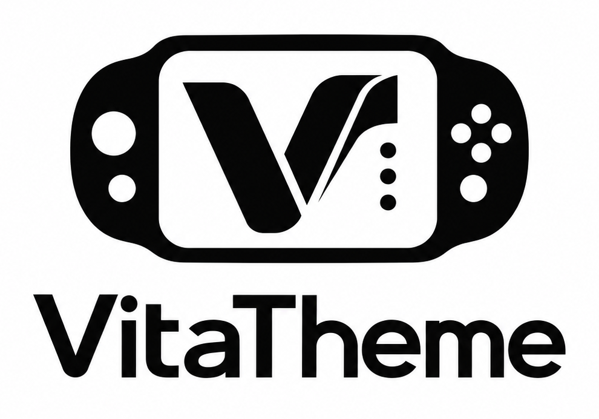

# VitaTheme

<p align="center">
  
</p>

VitaTheme is a desktop editor for creating, editing, previewing, validating and exporting custom PlayStation Vita themes.

## Features

- Edit LiveArea pages, system icons, the start screen, information bar, colours and metadata with a live preview.
- Generate page thumbnails and theme preview images from your artwork, with manual overrides when needed.
- Convert PNG, JPEG, BMP and GIF images to the size and PNG format each asset requires.
- Validate theme structure and assets before exporting a PS Vita theme folder or ZIP archive.
- Save editable `.vitatheme` projects with undo, redo and recovery of unsaved work.
- Reopen recent projects and drag artwork into the editor.

## Platform status

| Platform            | Status                                                                                           |
| ------------------- | ------------------------------------------------------------------------------------------------ |
| macOS Apple Silicon | Packaged and verified; the build is unsigned and not notarized.                                  |
| Windows x64         | NSIS installer configuration and Windows CI build are provided; runtime testing remains pending. |
| Linux x64           | AppImage build configuration is provided; runtime testing remains pending.                       |

The public release files, when available, will be attached to the GitHub release. Build instructions are below.

## Quick start from source

Requires Node.js 20.11 or later and pnpm.

```sh
pnpm install --frozen-lockfile
pnpm run dev
```

Run the full checks with `pnpm run check`. To build a packaged application for the current platform, run `pnpm run package:dir` followed by `pnpm run verify:package`. Packaging details are in [docs/packaging.md](docs/packaging.md).

## Projects and exports

A `.vitatheme` project is the editable source. Its companion `.assets` folder holds the artwork. Export creates a separate folder or ZIP containing `theme.xml` and the assets read by the PS Vita. Opening an existing theme does not change its files. See the [project format](docs/project-format.md) and [theme format reference](docs/ps-vita-theme-format.md).

Image conversion happens in the app, including PNG palette reduction where required. Background music must already be a valid ATRAC9 `.at9` file; VitaTheme does not encode audio or include Sony SDK tools.

## Security and privacy

VitaTheme works locally. It includes no telemetry, analytics or automatic update service. Themes and projects are treated as untrusted input: file paths are checked, image work is bounded and isolated in a worker, and the renderer has no direct filesystem or Node access. The [architecture](docs/architecture.md) and [packaging notes](docs/packaging.md) describe these boundaries. To report a vulnerability, use GitHub's private vulnerability reporting for this repository.

## Known limitations

- Some PS Vita theme rules are community reported rather than confirmed by official documentation; the validator labels that uncertainty.
- The live preview approximates console icon placement and is not an emulator.
- Release builds are currently unsigned. macOS and Windows may warn before first launch.
- VitaTheme edits and exports themes; it does not install them on a console.

Contributions are welcome; see [CONTRIBUTING.md](CONTRIBUTING.md). VitaTheme is licensed under the [MIT License](LICENSE). It is an independent project and is not affiliated with Sony Interactive Entertainment.
