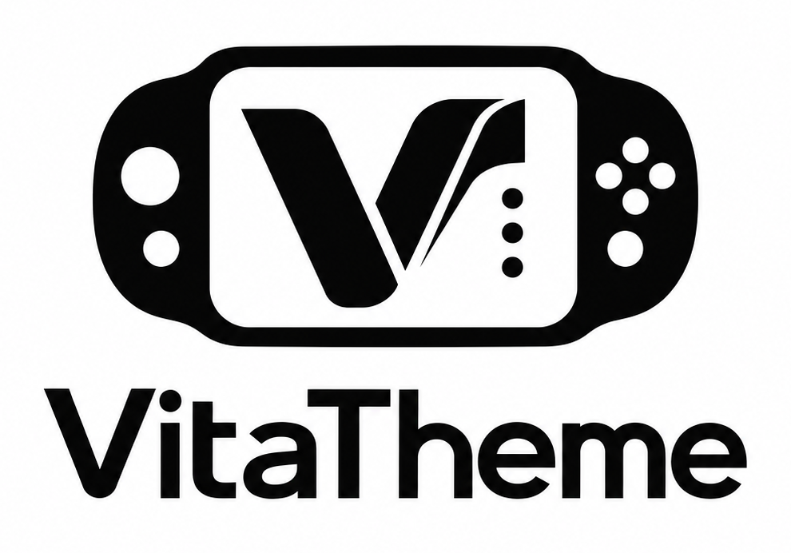
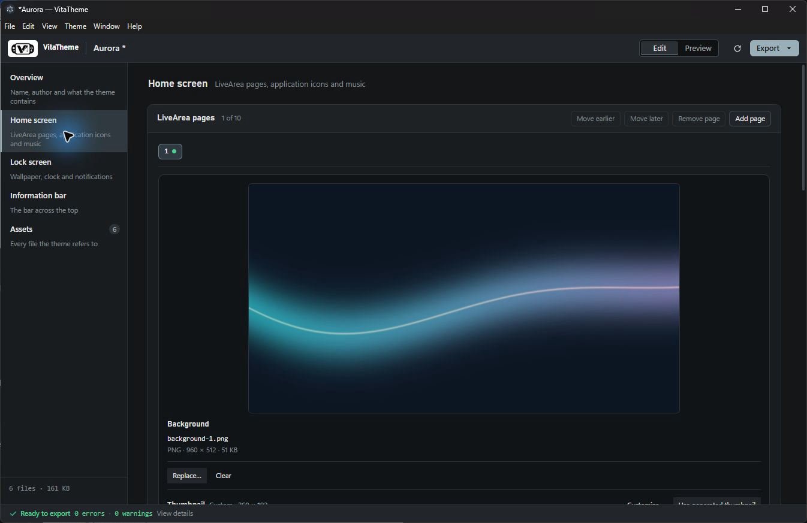
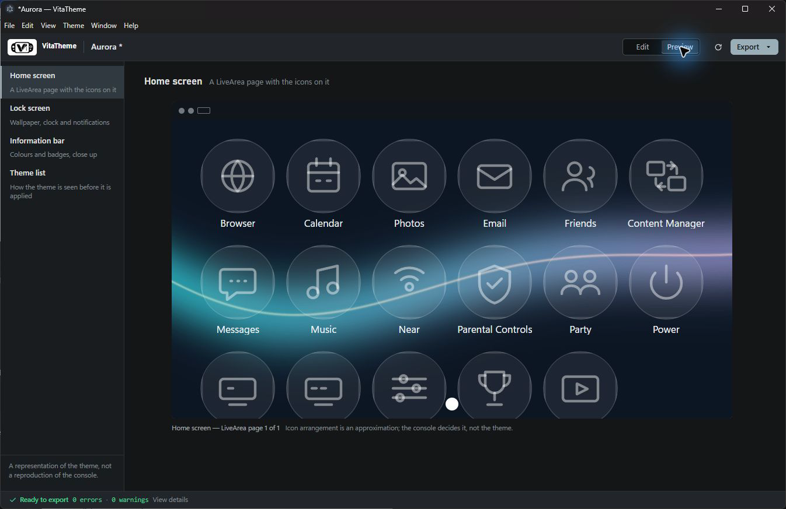
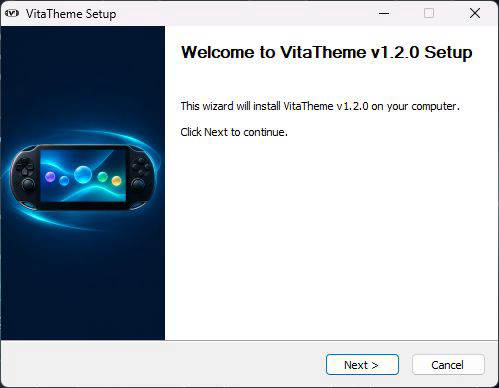

# VitaTheme

<p align="center">
  
</p>

VitaTheme is a desktop editor for creating, editing, previewing, validating and exporting custom PlayStation Vita themes.

**v1.2.0 is available for Windows x64.** Download the setup wizard or portable application from [GitHub Releases](https://github.com/jotadev27/VitaTheme/releases).

## Windows downloads

| File                                       | Use                                                                                               |
| ------------------------------------------ | ------------------------------------------------------------------------------------------------- |
| `VitaTheme-1.2.0-Windows-x64-Setup.exe`    | Install with the English setup wizard, embedded MIT license and destination selection.            |
| `VitaTheme-1.2.0-Windows-x64-Portable.exe` | Run without installing. Project history and recovery still use the local application data folder. |
| `SHA256SUMS.txt`                           | Verify the downloaded executable against its SHA-256 checksum.                                    |

Both applications include their runtime and work offline. Release executables are unsigned; Windows may display an unknown-publisher warning. Download them from this repository's releases.

## Screenshots

The screenshots use original demonstration artwork.

<p align="center">
  
</p>

Edit LiveArea backgrounds in a larger, centered frame.

<p align="center">
  
</p>

Preview the home screen, start screen and theme list before exporting.

<p align="center">
  
</p>

## Features

- Edit LiveArea pages, system icons, the start screen, information bar, colours and metadata with a live preview.
- Generate page thumbnails and theme preview images from your artwork, with manual overrides when needed.
- Position and zoom PNG, JPEG, BMP and GIF artwork in an interactive crop frame before producing each asset's required PNG.
- Validate theme structure and assets before exporting a PS Vita theme folder or ZIP archive.
- Save editable `.vitatheme` projects with undo, redo and recovery of unsaved work.
- Reopen recent projects and drag artwork into the editor.

## Platform status

| Platform            | Status                                                                               |
| ------------------- | ------------------------------------------------------------------------------------ |
| macOS Apple Silicon | Packaged and verified; the build is unsigned and not notarized.                      |
| Windows x64         | Setup and portable applications available in v1.2.0; package checks pass on Windows. |
| Linux x64           | AppImage build configuration is provided; runtime testing remains pending.           |

See the [v1.2.0 release notes](docs/releases/v1.2.0.md) for changes and current limitations.

## Quick start from source

Requires Node.js 22.12 or later and pnpm.

```sh
pnpm install --frozen-lockfile
pnpm run dev
```

The first `pnpm run dev` or `pnpm start` downloads the Electron runtime if it is missing.
Later runs reuse the installed executable. An internet connection is needed for that first download.

Run the full checks with `pnpm run check`. To build a packaged application for the current platform, run `pnpm run package:dir` followed by `pnpm run verify:package`. Packaging details are in [docs/packaging.md](docs/packaging.md).

## Projects and exports

A `.vitatheme` project is the editable source. Its companion `.assets` folder holds the artwork. Export creates a separate folder or ZIP containing `theme.xml` and the assets read by the PS Vita. Opening an existing theme does not change its files. See the [project format](docs/project-format.md) and [theme format reference](docs/ps-vita-theme-format.md).

Image conversion happens in the app, including PNG palette reduction where required. Background music must already be a valid ATRAC9 `.at9` file; VitaTheme does not encode audio or include Sony SDK tools.

`Replace music…` accepts existing AT9 audio. MP3, WAV, FLAC and OGG conversion is not included in v1.2.0. Imported music is checked before use and checked again when copied for saving or export. Loop metadata from existing Vita themes is preserved.

## Security and privacy

VitaTheme works locally. It includes no telemetry, analytics or automatic update service. Themes and projects are treated as untrusted input: file paths are checked, image work is bounded and isolated in a worker, and the renderer has no direct filesystem or Node access. AT9 files are never executed; their container structure, stream configuration and size are checked before use and copying. These checks validate the file format; they are not an antivirus scan. The [architecture](docs/architecture.md) and [packaging notes](docs/packaging.md) describe these boundaries. To report a vulnerability, use GitHub's private vulnerability reporting for this repository.

## Known limitations

- Some PS Vita theme rules are community reported rather than confirmed by official documentation; the validator labels that uncertainty.
- The live preview approximates console icon placement and is not an emulator.
- Release builds are currently unsigned. macOS and Windows may warn before first launch.
- VitaTheme edits and exports themes; it does not install them on a console.

Contributions are welcome; see [CONTRIBUTING.md](CONTRIBUTING.md). VitaTheme is licensed under the [MIT License](LICENSE). It is an independent project and is not affiliated with Sony Interactive Entertainment.
